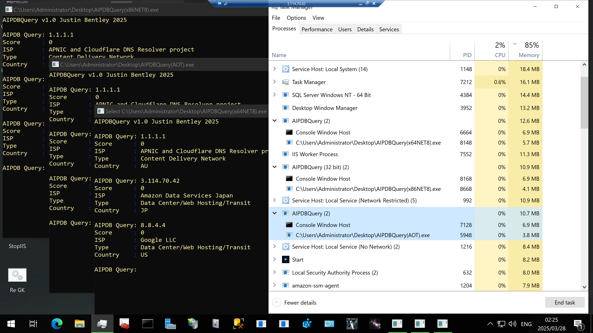

<i>who will win the memory wars?</i>

<i>tldr: x86 or AOT and never, ever x64!</i>

# AIPDBQuery, AbuseIPDB Query CLI Tool

This console application queries the AbuseIPDB API v2 to check an IP address for potential abuse reports. It returns the Abuse Confidence Score, ISP, Usage Type, and Country Code for the specified IP.

The tool uses a persistent HttpClient instance, pulls the API key from a local 'abuseipdbkey.config' file, and features color-coded terminal output for readability.
